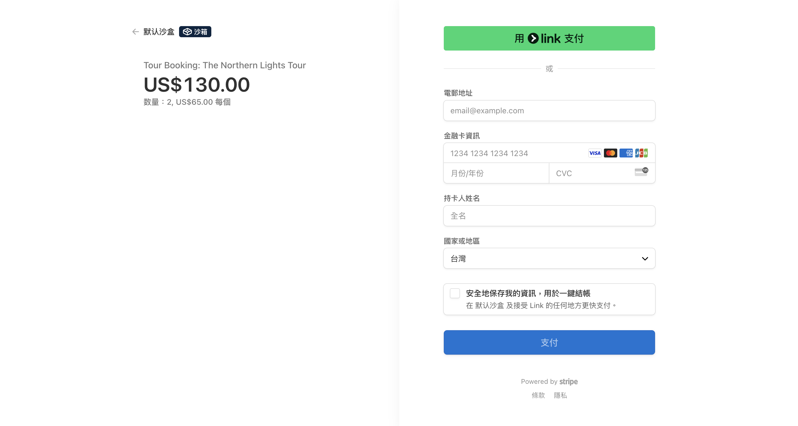
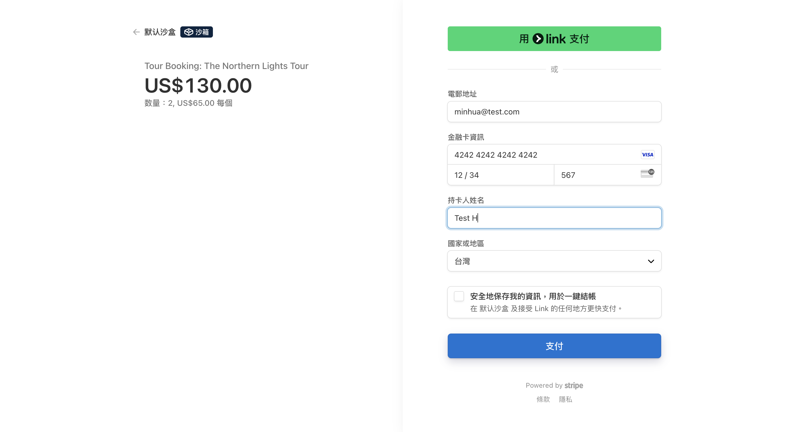

This project is the frontend for a complete Stripe payment integration, built with Vue 3, Vite, and vue-i18n. It works in conjunction with a Node.js backend to provide full order and payment functionality.

Backend repository (required): https://github.com/your-backend-repo/stripe-node-server

Features
- Stripe Checkout integration
- Multilingual support with vue-i18n
- Axios communication with backend server

Technologies
- Vue 3 + Vite
- vue-i18n
- Axios
- Stripe Checkout (via backend API)

Preview

